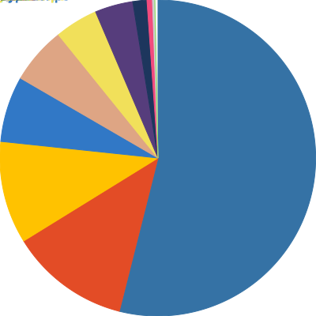

## Language Breakdown

<foreignObject>
<body xmlns="http://www.w3.org/1999/xhtml">
<table align="center">
<tr>
<td>

</td>
<td>

|Language|Bytes|
|:-:|:-:|
|Total|244753|
| Python|137670|
| Nim|29433|
| HTML|27604|
| TypeScript|19829|
| CSS|9097|
| JavaScript|7094|
| Rust|6026|
| Less|3792|
| C++|3174|
| QMake|852|
| Shell|182|

</td>
</tr>
</table>
</body>
</foreignObject>

Last Updated At:
Tuesday 09 Aug 2022 11:01:02

