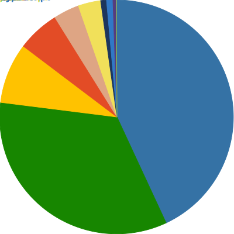

# About Me

Hey, I'm Isaac.

I really enjoy programming and learning new things.

Professionally I use C# and Angular,
but for personal projects I prefer to use Python or Nim

## Language Breakdown

<foreignObject>
<body xmlns="http://www.w3.org/1999/xhtml">
<table align="center">
<tr>
<td>

</td>
<td>

|Language|Bytes|
|:-:|:-:|
|Total|295306|
 Python|159200|
 HTML|36453|
 Nim|31156|
 TypeScript|19829|
 Rust|17008|
 JavaScript|13382|
 CSS|11766|
 Less|3792|
 C++|1726|
 QMake|778|
 Shell|216|

</td>
</tr>
</table>
</body>
</foreignObject>

Last Updated At:
Wednesday 02 Nov 2022 19:51:21

